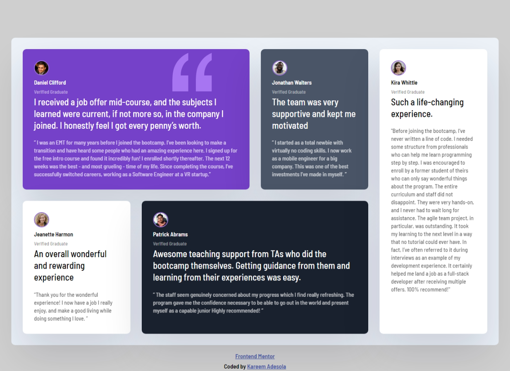

# Frontend Mentor - Testimonials grid section solution

This is a solution to
the [Testimonials grid section challenge on Frontend Mentor](https://www.frontendmentor.io/challenges/testimonials-grid-section-Nnw6J7Un7)

## Table of contents

- [Overview](#overview)
    - [The challenge](#the-challenge)
    - [Screenshot](#screenshot)
    - [Links](#links)
- [My process](#my-process)
    - [Built with](#built-with)
    - [What I learned](#what-i-learned)
    - [Continued development](#continued-development)
    - [Useful resources](#useful-resources)
- [Author](#author)
- [Acknowledgments](#acknowledgments)

## Overview

### The challenge

Users should be able to:

- View the optimal layout for the site depending on their device's screen size

### Screenshot

### Links

- Solution URL: [GitHub](https://github.com/kareemadesola/Testimonial-Grid-Section)
- Live Site URL: [Add live site URL here](https://your-live-site-url.com)

## My process

### Built with

- Semantic HTML5 markup
- CSS custom properties
- CSS Grid
- Mobile-first workflow

### What I learned

#### HTML

- How to use BEM naming convention for classes
- Adding Favicon to my website

#### CSS

- Using media queries for different screen sizes
- Using HSL color code format
- Applied newly learnt CSS properties such as `grid-template-columns`, `grid-column`, `grid-row`, `nth-of-type` selector
- Reinforced already learnt CSS properties

### Continued development

- Use more of CSS grids in future projects to reinforce my understanding
- Use CSS functions like `calc()` in future projects

### Useful resources

- [CSS grid crash course 2022](https://www.youtube.com/watch?v=0xMQfnTU6oo&t=1s) - This course
  by [Traversy Media](https://www.youtube.com/c/TraversyMedia) teach all the fundamentals of CSS grid

## Author

- Frontend Mentor - [@kareemadesola
  ](https://www.frontendmentor.io/profile/kareemadesola)
- Twitter - [@kareemadesola](https://twitter.com/KareemOluwa)

## Acknowledgments

I would like to give a hat tip to [Traversy Media](https://www.youtube.com/c/TraversyMedia) as
their [solution](https://github.com/bradtraversy/grid-crash/tree/main/project) gave an insight on how to build my
project
